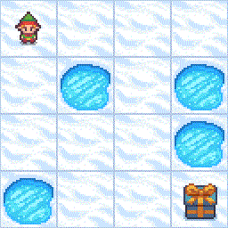

# Q-learning for FrozenLake

This repository contains an implementation of the **Q-learning** reinforcement learning algorithm applied to the **FrozenLake** environment from OpenAI Gym. The agent learns to navigate through a grid-based world to reach the goal while avoiding holes, using **Q-learning** to optimize its strategy.

## Game Visualization
Here is a gif of what the **FrozenLake** game looks like in action:
<p align="center">
  
</p>

## Project Overview

**FrozenLake** is a simple grid-based environment where an agent (a "robot") starts at a designated starting position and aims to reach the goal while avoiding obstacles (holes in the ice). The environment has discrete states and actions, making it a suitable candidate for **Q-learning** to be applied.

This implementation demonstrates how an agent learns optimal actions over episodes (a complete run through an environment, from the start to the goal or until the agent reaches a terminal state i.e. falls through a hole in the ice) using **Q-learning**. The **Q-table** is updated (an iteration) after each action based on rewards received.

## Key Concepts

- **Q-learning**: A reinforcement learning algorithm that helps an agent learn the value of actions in different states, ultimately learning a policy that maximizes its total reward. More detail on [Wikipedia](https://en.wikipedia.org/wiki/Q-learning).
- **Q-table**: A table (or matrix) that stores the Q-values of state-action pairs. Each row corresponds to a specific state in the environment, and each column corresponds to a specific action. Hence, each cell represents the **Q-value** of taking a specific action in a specific state the agent can take.
- **Q-value**: An estimate of the total (or future) reward the agent can expect to receive from that state-action pair, assuming it follows the optimal policy from there onward. Over time, the agent updates these values to improve its policy (the strategy for choosing actions).
- **State Space**: The set of all possible states in the environment. In FrozenLake, the agent moves on a grid, and the state is the position in the grid.
- **Action Space**: The possible actions the agent can take, i.e., moving up, down, left, or right.
- **Exploration vs. Exploitation**: The agent must balance exploring new actions (randomly) and exploiting known good actions (according to its Q-table).

## Requirements

Ensure you have the following Python libraries installed:

- `gym`
- `numpy`

To install these dependencies, run:

```bash
pip install gym numpy
```

### Running the Q-learning Algorithm

```bash
python q_learning_frozenlake.py
```

### TODO
- [ ] `README.md`: More detail. Hyperparameters. Training.
- [ ] `q_learning_frozenlake.py`: The Python code of course.

## License

This project is licensed under the [MIT License](LICENSE).

You are free to use, modify, and distribute this code, as long as you include the original copyright notice and disclaimers in your project.